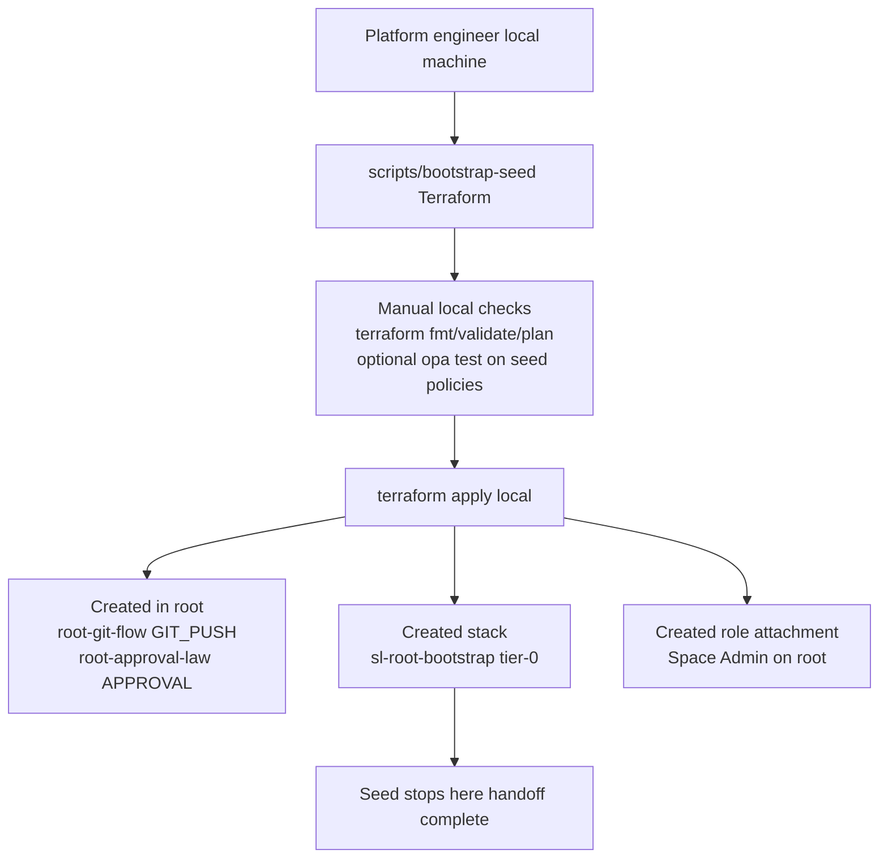
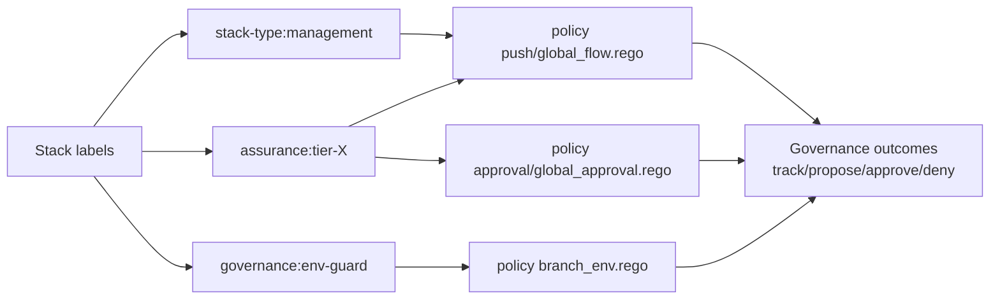

# Management Plane Architecture

This architecture is intentionally split into two separate control planes:
1. Local bootstrap seed (`scripts/bootstrap-seed`) that establishes root trust.
2. Runtime bootstrap stack (`sl-root-bootstrap`) that runs inside Spacelift and builds environment cells.

## Diagram 1: Local Seed Control Plane (`scripts/bootstrap-seed`)



### Seed Testing and Execution Mode

- `terraform fmt`, `terraform validate`, `terraform plan`: local/manual.
- optional `opa test ./scripts/bootstrap-seed/policies`: local/manual.
- execution context: local Terraform using admin API key.
- stopping point: after `sl-root-bootstrap` stack and root governance are created.

## Diagram 2: Runtime Control Plane (`sl-root-bootstrap` in Spacelift)

```mermaid
flowchart TD
    Commit[Commit to repo]
    RuntimeStack[Spacelift stack sl-root-bootstrap]
    Hooks[Automatic before_plan hooks\n.spacelift/config.yml]
    Gate[scripts/assurance-gate.sh]
    PolicyTests[opa test ./policies]
    Validate[terraform fmt check and terraform validate]
    PlanApply[Plan and apply of root module]
    Checks[Terraform check blocks in checks.tf]
    Manifest[manifests/management-plane.yaml]

    subgraph Cell[Per environment cell]
      EnvRoot[Top-level environment space\ninherit_entities=false]
      EnvPolicies[Environment policies\nGIT_PUSH PLAN APPROVAL]
      SubSpaces[Subspaces from bootstrap_spaces\nfor example admin]
      Orch[Tier-1 orchestrator stack\n${environment}-admin-stacks-orchestrator]
      RoleAttach[Space Admin role attachment\nscoped to environment root]
    end

    Commit --> RuntimeStack
    RuntimeStack --> Hooks
    Hooks --> Gate
    Gate --> Validate
    Gate --> PolicyTests
    RuntimeStack --> PlanApply
    Manifest --> PlanApply
    Checks --> PlanApply
    PlanApply --> EnvRoot
    PlanApply --> EnvPolicies
    PlanApply --> SubSpaces
    PlanApply --> Orch
    PlanApply --> RoleAttach
```

### Runtime Testing and Execution Mode

- `scripts/assurance-gate.sh`: automatic in Spacelift `before_plan`.
- `terraform fmt -check -recursive` and `terraform validate`: automatic via gate.
- `opa test ./policies`: automatic via gate.
- `check` blocks in `checks.tf`: automatic at Terraform plan/apply evaluation.
- optional seed-policy tests: include via `INCLUDE_SEED_POLICY_TESTS=true`.

## Diagram 3: Label Governance Strategy



## Assurance Tiering

| Tier | Name | Responsibility | Identity |
| :--- | :--- | :--- | :--- |
| **Tier 0** | Foundation | Establish root of trust and bootstrap identity | `sl-root-bootstrap` |
| **Tier 1** | Orchestrator | Manage environment hierarchy and local governance | `${environment}-admin-stacks-orchestrator` |
| **Tier 2** | Critical Workload | Mission-critical infrastructure | production/live workloads |
| **Tier 3+** | Standard Workload | General application resources | dev/test workloads |
